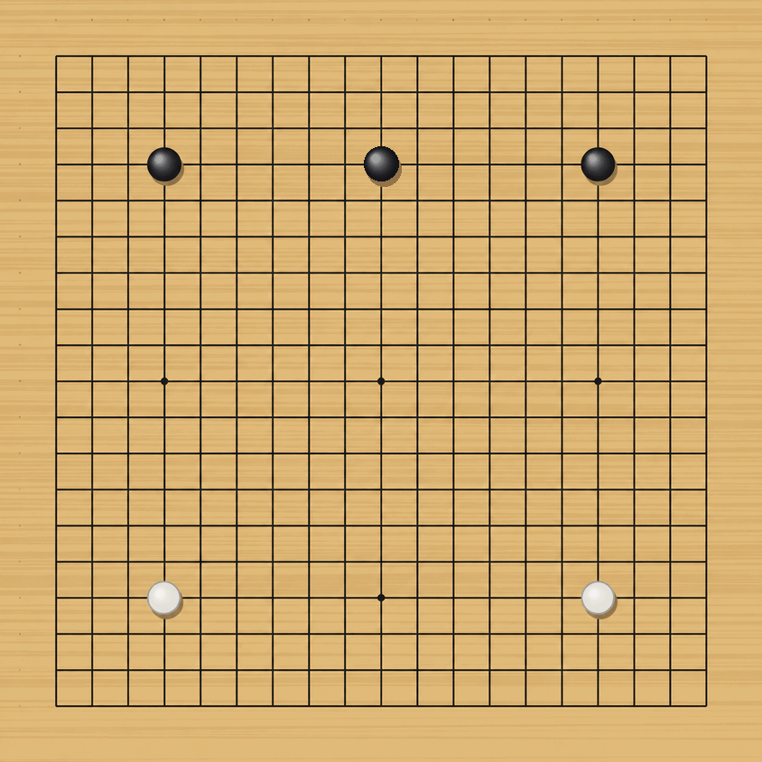

# 바둑 기보 (Baduk)

19×19 바둑판 진행 이미지 시리즈. 흑은 Claude가, 백은 사용자가 둡니다.

## 기보

| 파일 | 수순 | 설명 |
| --- | --- | --- |
| `go_board_1.png` | 흑 D16 | 흑 첫수. 좌상귀 4-4 화점 |
| `go_board_2.png` | 백 Q4 | 백이 대각 화점으로 응수 |
| `go_board_3.png` | 흑 Q16 | 흑이 우상귀 화점을 차지, 상변 구도 |
| `go_board_4.png` | 백 D4 | 백이 좌하귀 화점, 하변 구도 |
| `go_board_5.png` | 흑 K16 | 흑이 상변 화점으로 D16–Q16 사이 확장 |

## 좌표 표기

19×19 표준 좌표계. 가로는 `A`–`T` (`I` 제외), 세로는 `1`–`19` (아래가 1).

- **D16 / Q16 / K16** — 좌상귀·우상귀·상변 4-4 화점
- **D4 / Q4** — 좌하귀·우하귀 4-4 화점

`I`를 건너뛰는 것은 세로선 1과 숫자 1의 혼동을 피하기 위한 관례입니다.

## 국면



## 도구

`baduk_tools.py` — 바둑판 이미지에서 국면을 읽고 돌을 덮어 그립니다.

```
python baduk_tools.py read <image>
python baduk_tools.py play <src> <dst> <gx> <gy>
```

`gx`는 좌→우 0–18, `gy`는 위→아래 0–18. 예: D16 = `3 3`, K16 = `9 3`.
