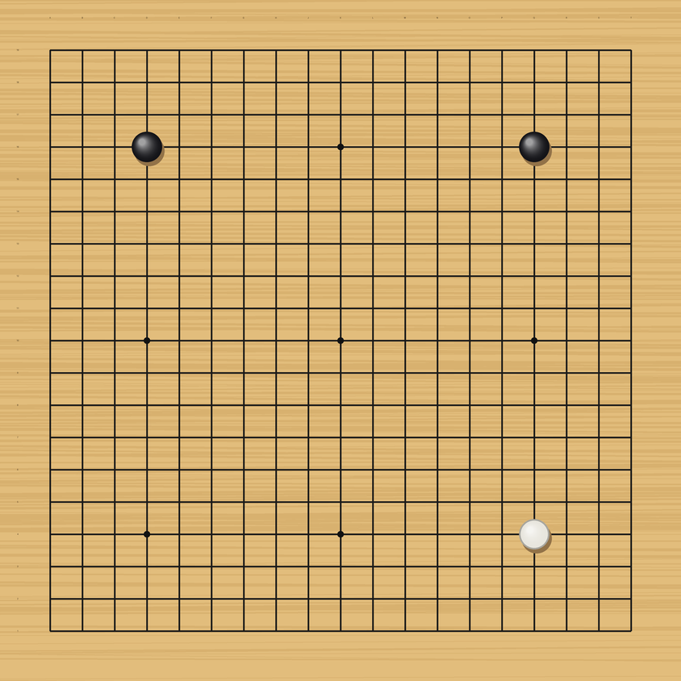

# 바둑 기보 (Baduk)

19×19 바둑판 진행 이미지 시리즈.

## 기보

| 파일 | 진행 | 설명 |
| --- | --- | --- |
| `go_board_1.png` | 흑 D16 | 흑 첫수. 좌상귀 4-4 화점 |
| `go_board_2.png` | 흑 D16 → 백 Q4 | 백이 대각 화점으로 응수 |
| `go_board_3.png` | 흑 D16 → 백 Q4 → 흑 Q16 | 흑이 우상귀 화점을 차지, 상변 구도 |

## 좌표 표기

19×19 표준 좌표계. 가로는 `A`–`T` (`I` 제외), 세로는 `1`–`19` (아래가 1).

- **D16** — 좌상귀 4-4 화점
- **Q16** — 우상귀 4-4 화점
- **Q4** — 우하귀 4-4 화점

`I`를 건너뛰는 것은 세로선 1과 숫자 1의 혼동을 피하기 위한 관례입니다.

## 국면

